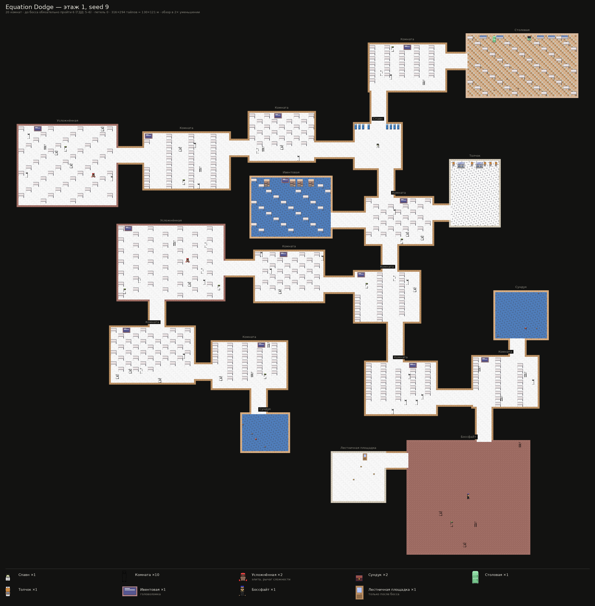
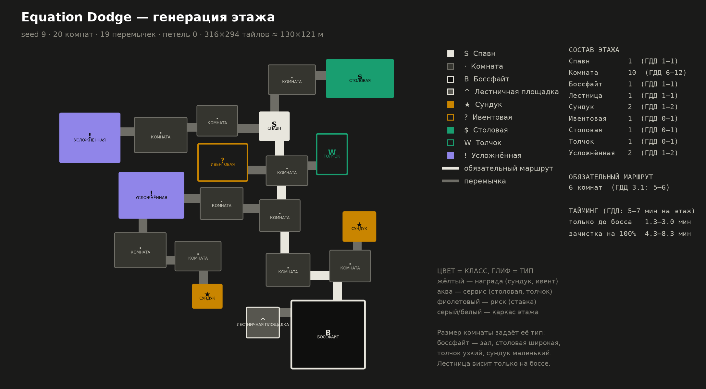

# Equation Dodge — генератор этажей

Прототип алгоритма генерации комнат из раздела 3 ГДД «Equation Dodge».
Python-версия нужна, чтобы проверить алгоритм и баланс **до** того, как писать
код под Godot: здесь за секунду прогоняются тысячи этажей и видно, что
получается.

📄 **[Алгоритм и замеры → docs/room_generation.md](docs/room_generation.md)**
🎨 **[Тайлы и реальные спрайты → docs/sprites.md](docs/sprites.md)**



Тот же этаж схемой — так удобнее читать структуру:



## Запуск

```bash
python3 -m roomgen show --seed 12     # этаж в терминале, без зависимостей
python3 -m roomgen check --count 2000 # прогнать 2000 сидов через проверки
python3 -m roomgen render --out out   # PNG: схема, лист сидов, статистика
python3 -m roomgen pixels --seed 12   # PNG: этаж реальными спрайтами проекта
python3 -m roomgen export --seed 12   # JSON с сеткой тайлов для сцены Godot
python3 -m unittest discover -s tests # 29 тестов
```

Генератор, тайловая сетка и проверки работают на голом stdlib. matplotlib нужен
для `render`, Pillow — для `pixels` (`pip install -r requirements.txt`).

## Что внутри

| Файл | Что делает |
|---|---|
| `roomgen/config.py` | все числа в одном месте: размеры комнат, лимиты типов, вероятности, тайминги |
| `roomgen/generator.py` | свободная упаковка комнат: хребет, ответвления, петли |
| `roomgen/validation.py` | геометрия, связность, лимиты, «лестница только за боссом» |
| `roomgen/ascii_render.py` | этаж в терминале |
| `roomgen/viz.py` | схема, лист сидов и графики статистики на matplotlib |
| `roomgen/tilemap.py` | комнаты и перемычки → сетка тайлов + экспорт в JSON для Godot |
| `roomgen/sprites.py` | атлас реальных спрайтов из `spites/` |
| `roomgen/render_sprites.py` | рендер этажа пиксель-артом |
| `spites/` | спрайты проекта, как в Godot (`res://spites/`) |
| `tests/` | инварианты, детерминированность, распределения, тайловая сетка |

## Результат на 1500 сидах

- 19.0 комнат на этаже в среднем (ГДД: 16–22, в среднем 18–20)
- обязательный маршрут до босса — 5–6 комнат на каждом сиде (ГДД 3.1: 5–6)
- сундук и усложнённая комната — на 100% этажей, ивент — на 46% (ГДД: 50%)
- размер комнаты кодирует тип: боссфайт — арена 28×23 м, обычная — 17×12 м
- петли есть у большинства этажей и не укорачивают путь до босса
- зачистка на 100% — 3.9–7.6 мин при цели ГДД 5–7, середина 5.8
- 0 этажей с нарушениями, генерация с первой попытки
- один сид всегда даёт один и тот же этаж

## Что взято из концепт-схемы

Сетки нет: этаж выращивается свободной упаковкой прямоугольников от спавна.

1. **Размер кодирует тип** — боссфайт крупнее всех, столовая широкая, толчок
   узкий, сундук маленький. Поэтому тип комнаты решается **до** её постановки.
2. **Связи — короткие прямые перемычки** между стенами соседних комнат.
3. **Спавн в середине, босс на дальнем краю** — хребет уходит в выбранную на
   этаж сторону.
4. **Петли** добавляются отдельным проходом и не укорачивают путь до босса.

Подробности и замеры — в [docs/room_generation.md](docs/room_generation.md).
