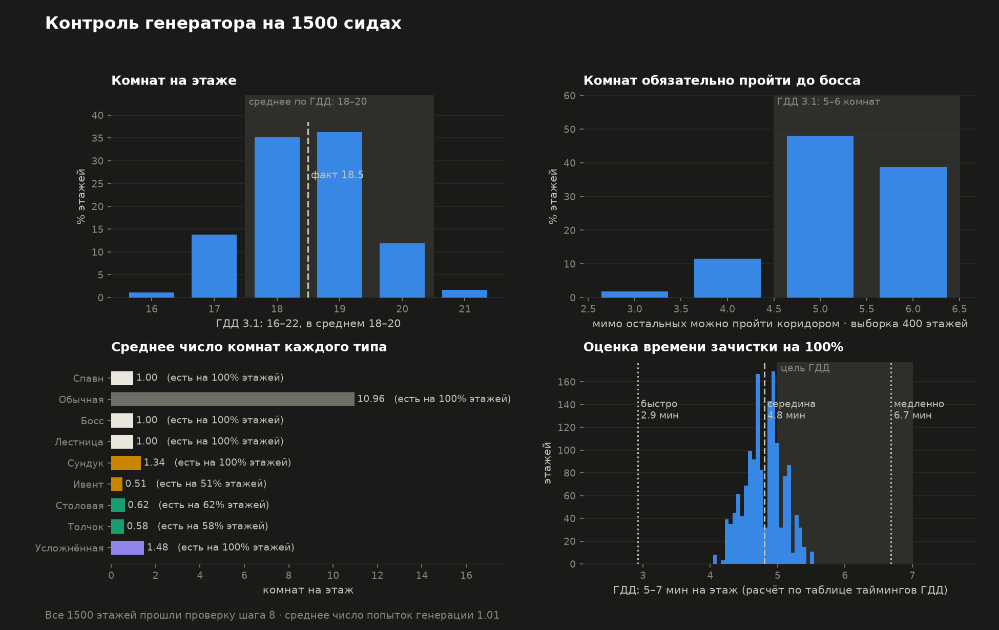
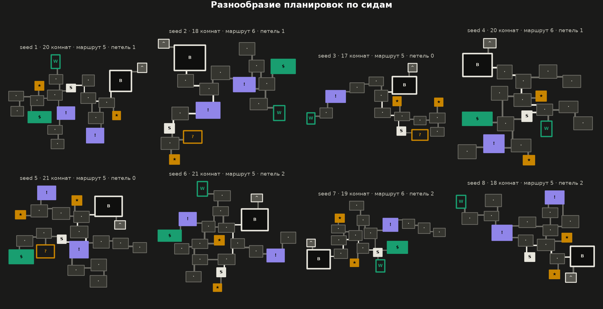

# Генерация этажа «Equation Dodge»

Прототип алгоритма из раздела 3 ГДД на Python: сначала считаем и смотрим глазами,
и только потом переносим в Godot.

- Код: [`roomgen/`](../roomgen)
- Тесты: `python3 -m unittest discover -s tests`
- Картинки: `python3 -m roomgen render`


---

## 1. Что зафиксировано из ГДД

| Параметр | ГДД | В коде |
|---|---|---|
| Форма этажа | сетка 5×5 | `GenConfig.height/width` |
| Комнат на этаже | 16–22, в среднем 18–20 | `total_rooms`, `total_rooms_peak` |
| Спавн | фиксированный угол (0,0) | `spawn` |
| Босс | противоположный угол (4,4) | `boss` |
| Лестница | (4,3) или (3,4), всегда после босса | `stairs_candidates` |
| Обычных комнат | 6–12 | `caps[NORMAL]` |
| Усложнённых | 1–2 | `hard_rooms`, `caps[HARD]` |
| Столовая / толчок | 0–1 каждой | `caps` |
| Сундук | 1–2 | `caps[CHEST]` |
| Ивентовая | 0–1, шанс 50% | `event_chance` |
| Шанс ответвления | 40–60% | `branch_chance` |
| Длина тупика | 1–3 комнаты | `branch_length` |
| Тип конца тупика | 40% сундук / 30% столовая / 30% толчок | `branch_terminal_weights` |
| Связи | только по горизонтали и вертикали | `GenConfig.neighbors` |

Все числа лежат в одном месте — `roomgen/config.py`. Баланс правится там,
код генератора трогать не нужно.

---

## 2. Алгоритм

### Шаг 1–2. Сетка и якорные комнаты

Пустая сетка 5×5. Спавн в (0,0), босс в (4,4), лестница — случайно в (4,3) или (3,4).

**Лестница сразу соединяется с боссом и больше ни с чем.** Это единственное
жёсткое правило топологии: в ГДД сказано «лестничная площадка всегда после
босса», и если разрешить лестнице ещё одну дверь, игрок сможет уйти на
следующий этаж в обход боссфайта. В тестах это проверяется явно
(`test_stairs_only_behind_boss`).

### Шаг 3. Основной путь

Самонепересекающийся случайный путь спавн → босс. Реализован поиском в глубину
с откатом: на каждом шаге соседи перемешиваются с весом (движение к боссу
получает вес `toward_boss_weight = 3`, вбок и назад — 1), а ветки, из которых
до босса уже не дойти за оставшийся бюджет шагов, отсекаются по двум условиям:

```
manhattan(следующая, босс) ≤ осталось_шагов
(осталось_шагов − manhattan(следующая, босс)) чётно
```

Отсечение по чётности — это то, что делает генерацию однопроходной: путь
нужной длины находится с первой попытки, «перезапуск генерации» из ГДД
срабатывает как страховка, а не как рабочий режим (в среднем **1.01 попытки на
этаж** на 2000 сидов).

### Шаг 4. Ответвления (тупики)

Каждая комната основного пути, кроме спавна и босса, с вероятностью 40–60%
отращивает цепочку из 1–3 пустых клеток. Крайняя комната цепочки получает
специальный тип по весам 40/30/30; если лимит типа уже выбран (столовая и
толчок — по одной на этаж), комната остаётся обычной, как и требует ГДД.

### Шаг 7. Заполнение и развилки

Этаж добирается обычными комнатами до целевого размера (треугольное
распределение 16–22 с модой 19 — «в среднем 18–20» из ГДД). Каждая новая
комната пристраивается ровно одной дверью к случайной уже существующей, кроме
защищённых: босса, лестницы и тупиковых наград.

После этого часть соседних пар комнат получает дополнительную дверь
(`loop_door_chance = 12%`) — это развилки из ГДД 3.3. Тупиковые и защищённые
типы в петлях не участвуют.

### Шаг 5–6. Усложнённые и ивентовая комнаты

Конвертация уже существующих обычных комнат:

- **Ивент** — 50% на этаж, только тупик вне основного пути (ГДД 5.4.2: игрок
  сам решает, заходить или нет, значит комната не должна стоять на маршруте).
- **Усложнённые** — 1–2 на этаж, тупик предпочтительнее (75%), иначе с пути.

Обе конвертации освобождают лимит «обычных комнат», поэтому после них этаж
добирается до целевого размера ещё раз.

### Шаг 8. Проверка

`roomgen/validation.py` — 7 групп проверок: якоря на местах, двери только между
ортогональными соседями-комнатами, лестница только за боссом, у босса ровно
один вход, всё достижимо от спавна, лимиты типов, тупиковые награды остались
тупиками, основной путь — настоящий путь по дверям. Этаж с нарушениями наружу
не отдаётся: генератор перезапускается с новым сидом.

---

## 3. Три места, где ГДД пришлось поправить

### 3.1. «Основной путь 5–6 комнат» невыполним *цепочкой комнат*

Манхэттенское расстояние от (0,0) до (4,4) равно 8, ходить можно только по
горизонтали и вертикали, значит **цепочка комнат от спавна до босса короче 9
не бывает**. Чётность разрешает только 9, 11, 13. Собственный пример из ГДД
(`(0,0) → (0,1) → (1,1) → … → (4,4)`) — ровно 9 комнат, то есть пример
противоречит тексту рядом с ним.

Взято: 9 комнат (55%), 11 (35%), 13 (10%) — `main_path_lengths`.

**Но само требование выполнимо — школьной планировкой.** Когда комнаты
соединены не дверь-в-дверь, а через сквозной коридор, мимо большинства из них
можно пройти, не заходя. Обязательными остаются только те, через которые
коридор не ведёт. На тайловой планировке (см. [docs/sprites.md](sprites.md))
это даёт **в среднем 5.25 комнаты, 87% этажей попадают в 5–6** — ровно то
число, которое просит ГДД. То есть ГДД описывает не длину цепочки, а длину
обязательного маршрута, и в школьном плане она получается сама собой.

### 3.2. Порядок шагов ГДД ломает ивентовые комнаты

В порядке ГДД (4 → 5 → 6 → 7) выбор ивентовой комнаты идёт **до** заполнения
этажа. К этому моменту тупиков почти нет: все концы ответвлений уже стали
сундуком, столовой или толчком. Замер на 3000 сидов: ивентовая комната
выпадала на **1% этажей вместо заявленных 50%**.

Взято: заполнение (шаг 7) выполняется перед конвертациями, а шаг 6 — перед
шагом 5, потому что у ивента требование жёстче («тупик вне основного пути»), а
усложнённой комнате тупик лишь «предпочтителен» — иначе усложнённые выедали
пул тупиков и ивент падал до 24%. Набор шагов и все вероятности из ГДД те же,
меняется только момент выбора типа. Итог — **51%**.

### 3.3. Двери нельзя выводить из соседства клеток

ГДД говорит «каждая комната соединена с соседними по горизонтали и вертикали»,
и тут же, шагом 7, просит заполнить пустые ячейки обычными комнатами. Вместе
эти два правила уничтожают тупики: заполнение подходит вплотную к сундуку, и
он превращается в проходной коридор — а вся схема «награда в конце тупика» из
шага 4 держится именно на тупике.

Взято: **двери хранятся явным списком рёбер**, а не выводятся из соседства.
Физически соседние комнаты без двери — нормальная ситуация (так устроен
The Binding of Isaac), а развилки добавляются управляемо на шаге 7.

---

## 4. Что показывают замеры



На 1500 сидах:

| Метрика | ГДД | Факт |
|---|---|---|
| Комнат на этаже | 16–22, в среднем 18–20 | 16–21, среднее **18.5** |
| Цепочка комнат до босса | — | 9 / 11 / 13 |
| **Обязательно пройти комнат** | **5–6** | **5.25 в среднем, 87% в 5–6** |
| Сундук на этаже | 1–2 | **100%** этажей, в среднем 1.34 |
| Усложнённая | 1–2 | **100%** этажей, в среднем 1.48 |
| Ивентовая | 50% | **51%** |
| Столовая | 0–1 | 62% |
| Толчок | 0–1 | 58% |
| Нарушений шага 8 | — | **0** |
| Попыток генерации | — | 1.01 |



### Два вопроса к балансу (алгоритм тут ни при чём, это настройка)

1. **Время этажа.** По таблице таймингов ГДД зачистка на 100% выходит
   **2.9–7.1 мин**, середина оценки — 4.8 мин при заявленных 5–7. Этаж
   попадает в цель только по верхней границе. Либо это норма для первого
   этажа (дальше время растёт вместе со сложностью — так в ГДД и написано),
   либо на этаж нужно ещё 2–3 комнаты. С коридорами оценка стала двусторонней:
   спидран по обязательным 5–6 комнатам — около 2 минут, полная зачистка —
   те самые 5–7.

2. **Столовая и толчок есть только на ~60% этажей.** Формально это в рамках
   ГДД (0–1 на этаж), но толчок — единственный способ сбросить кортизол, а
   столовая — единственный магазин. Забег из 5 этажей, где толчка не было ни
   разу, вполне вероятен (≈1%). Если механика кортизола должна работать,
   стоит гарантировать толчок хотя бы через этаж — это одна строка в
   `repair_minimums`.

---

## 5. Перенос в Godot 4

Алгоритм специально написан на голом stdlib, без numpy и без классов, которых
нет в GDScript, — переносится один в один:

| Python | GDScript |
|---|---|
| `RoomType` (Enum) | `enum RoomType { EMPTY, SPAWN, ... }` |
| `GenConfig` (dataclass) | `Resource` с `@export` — правится в инспекторе |
| `dict[(r,c)] → RoomType` | `Array[Array]` или `Dictionary` с `Vector2i` |
| `set[frozenset(a,b)]` | `Dictionary` с ключом `"%s-%s" % [min, max]` |
| `random.Random(seed)` | `RandomNumberGenerator` + `rng.seed` |
| `validate()` | тот же список проверок, вызывается в `_ready()` отладки |

Тайловый слой уже готов — см. [docs/sprites.md](sprites.md): `tilemap.py`
превращает планировку в сетку пола, стен и проёмов, а `roomgen export` отдаёт
её в JSON вместе с таблицей вырезок из `res://spites/floors/tiles.png`.

Порядок работ:

1. `FloorGenerator.gd` — порт `generator.py` (чистая логика, без нод).
2. `FloorTiles.gd` — порт `tilemap.py` (те же 13×9 и зазор в 3 тайла).
3. `FloorData` (`Resource`) — результат генерации, живёт в `Global.gd`.
4. `Minimap.gd` — рисует ту же карту, что и `viz.py`, по тем же глифам и цветам.
5. `Room.tscn` на `TileMapLayer`: сетка тайлов кладётся напрямую, оформление
   комнаты берётся из таблицы `THEME`.
6. Порт тестов в GUT или простой отладочный прогон 1000 сидов при старте.

Планировка (какие комнаты и где) и наполнение комнаты (тайлы, враги, лут) —
разные слои. Генератор отдаёт только планировку; `Room.tscn` подставляет
содержимое по типу комнаты и номеру этажа.
