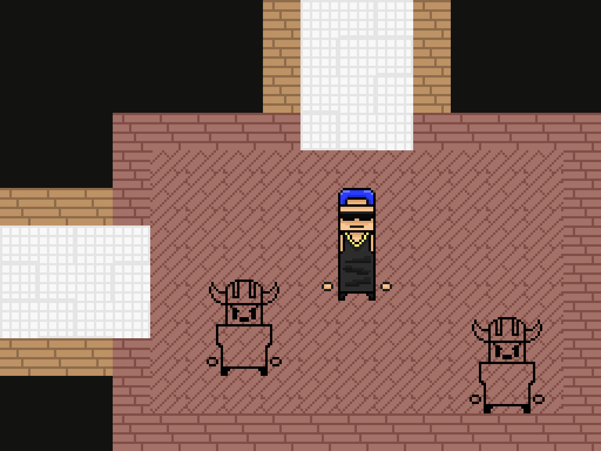

# Этаж на реальных спрайтах

Второй слой поверх генератора: планировка из [`docs/room_generation.md`](room_generation.md)
превращается в сетку тайлов и рисуется настоящими спрайтами проекта из `spites/`.

```bash
python3 -m roomgen pixels --seed 12 --floor 1   # PNG: этаж целиком и крупный план
python3 -m roomgen export --seed 12             # JSON с сеткой тайлов для Godot
```


---

## 1. Три слоя, которые не знают друг о друге

| Слой | Файл | Что делает | Зависимости |
|---|---|---|---|
| Планировка | `generator.py` | какие комнаты и где, где двери | stdlib |
| Тайлы | `tilemap.py` | комнаты → сетка пола, стен и проёмов | stdlib |
| Картинка | `render_sprites.py` | сетка → пиксели, предметы, враги | Pillow |

Разделение не косметическое: в Godot первые два слоя переносятся как есть
(чистый GDScript без нод), а третий заменяется на `TileMapLayer` и сцены комнат.
Генератор при этом не меняется вообще.

## 2. Комната на тайлах

Комната — блок 13×9 тайлов по 16 px: внешнее кольцо стен, внутри пол.
Между блоками остаётся 3 тайла, и коридор шириной 3 тайла прорезается **только
там, где генератор поставил дверь**. Соседство блоков прохода не даёт — это то
же правило, что и в графе комнат, просто проверенное на тайлах
(`test_corridor_exists_exactly_for_doors`).

```
#############   #############
#...........#   #...........#
#...........#####...........#
#...........+...+...........#   + — проём, . — пол, # — стена
#...........+...+...........#
#...........+...+...........#
#...........#####...........#
#...........#   #...........#
#############   #############
```

Этаж 5×5 разворачивается в сетку 77×57 тайлов — 1232×912 px в масштабе 1:1.

Два тайла перед каждым проёмом внутри комнаты помечаются занятыми
(`APPROACH = 2`): иначе шкаф встаёт ровно в дверях.

## 3. Какими тайлами красится комната

`floors/tiles.png` — ровная сетка: тайл 16×16, шаг 32, начало (16,16).
Ряд 0 — кирпичные стены пяти цветов, дальше семейства полов по три ряда.
Тип комнаты выбирает семейство пола и цвет кирпича:

| Комната | Пол | Стены |
|---|---|---|
| Спавн | зелёный | коричневый кирпич |
| Обычная | школьная плитка | коричневый кирпич |
| Усложнённая | школьная плитка | **красный** кирпич |
| Столовая | паркет | светлый кирпич |
| Толчок | белая плитка | белый кирпич |
| Сундук, ивент | синий | оранжевый кирпич |
| Лестница | школьная плитка | белый кирпич |
| Босс | красный | **красный** кирпич |

Внутри семейства вариант тайла выбирается по координате и сиду — пол не выглядит
залитым одним цветом, но остаётся детерминированным.

Коридоры и проёмы всегда школьной плиткой: проход читается как проход,
куда бы он ни вёл.

## 4. Наполнение комнаты

Предметы ставятся раскладчиком, который считает площадь спрайта в тайлах:
спрайт «стоит» на тайле, центрируется по горизонтали и растёт вверх, поэтому
высокий шкаф сам отходит от верхней стены, а занятые тайлы больше никому не
достаются. У персонажей вокруг занятой площади остаётся зазор в один тайл,
иначе два силуэта сливаются в одну фигуру.

| Комната | Что стоит |
|---|---|
| Спавн | герой + два шкафчика |
| Обычная | парта + враги |
| Усложнённая | парта + элитный враг + враги |
| Столовая | холодильник, плита, стойка, монеты |
| Толчок | два унитаза, раковина |
| Сундук | сундук (второй — золотой), монеты |
| Ивент | доска, парты |
| Лестница | дверь + три звезды (три стойки с перками, ГДД 5.3) |
| Босс | босс + свита |


Число врагов растёт с номером этажа (`--floor N`), как требует ГДД 4.4:
обычная комната `2 + этаж/2`, усложнённая `4 + этаж/2` плюс элита.



## 5. Откуда взяты координаты спрайтов

Из `spites/` разобраны шесть листов. Координаты вырезок получены не на глаз:
по каналу прозрачности искались связные области вокруг заданной точки, поэтому
рамка совпадает со спрайтом пиксель в пиксель. `Atlas.get()` дополнительно
обрезает прозрачные поля.

| Лист | Что берётся |
|---|---|
| `floors/tiles.png` | пол и стены (ровная сетка 16×16) |
| `objects/furniture (2).png` | унитаз, раковина, холодильник, плита, стойка, доска, парта, шкафчик |
| `ui/coins-chests-etc-2-0.png` | сундуки, монеты, звёзды, сердца |
| `heros/main_hero/nameless.png` | герой |
| `heros/enemies/enemies.png` | «Переписанные», элита, босс |
| `walls/floor_walls.png` | дверь |

Все названные вырезки проверяются тестом `test_all_named_sprites_load`: если
художник подвинет спрайт на листе, тест это поймает.

**Чего в наборе не хватает:** отдельного спрайта лестничного пролёта. Сейчас
лестничная площадка обозначается дверью из `walls/floor_walls.png` — заменить
на настоящий спрайт достаточно одной строкой в `sprites.py`.

## 6. Экспорт в Godot

```bash
python3 -m roomgen export --seed 12 --out out/floor_12.json
```

В JSON лежит всё, что нужно сцене: комнаты с типами и их блоки в тайлах, двери,
основной путь, готовая сетка тайлов построчно и таблица `tileset` — какие
вырезки из `res://spites/floors/tiles.png` класть под каждый тип комнаты.

```json
{
  "tiles": { "size": 16, "width": 77, "height": 57,
             "rows": ["2111111111113111311111...", "..."],
             "legend": {"0": "empty", "1": "floor", "2": "wall", "3": "doorway"} },
  "tileset": { "source": "res://spites/floors/tiles.png",
               "floor_by_room": {"cafeteria": "parquet", "boss": "red"},
               "floor_families": {"parquet": [[16, 48, 16, 16], "..."]} }
}
```

Папка `spites/` в репозитории лежит с теми же `.import`-файлами, что и в
Godot-проекте, и рассчитана на путь `res://spites/` — UID текстур не ломаются.
