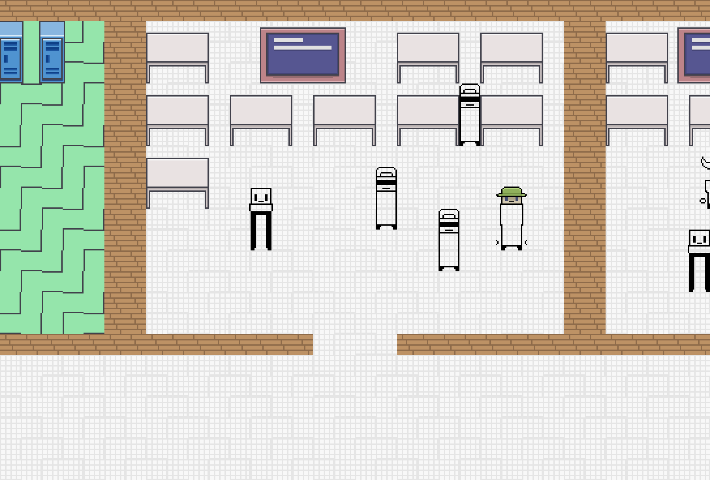
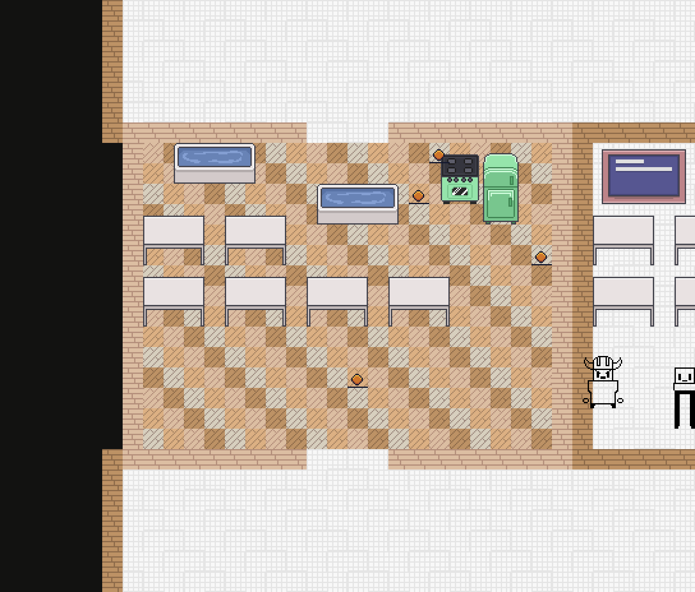

# Этаж как школа: тайлы и реальные спрайты

Второй слой поверх генератора: планировка из [`docs/room_generation.md`](room_generation.md)
превращается в сетку тайлов школьного здания и рисуется настоящими спрайтами
проекта из `spites/`.

```bash
python3 -m roomgen pixels --seed 12 --floor 1   # PNG: этаж целиком и крупный план
python3 -m roomgen export --seed 12             # JSON с сеткой тайлов для Godot
```


---

## 1. Три слоя, которые не знают друг о друге

| Слой | Файл | Что делает | Зависимости |
|---|---|---|---|
| Планировка | `generator.py` | какие комнаты и где, где двери | stdlib |
| Тайлы | `tilemap.py` | комнаты → школьное здание в тайлах | stdlib |
| Картинка | `render_sprites.py` | тайлы → пиксели, мебель, враги | Pillow |

Разделение не косметическое: в Godot первые два слоя переносятся как есть
(чистый GDScript без нод), а третий заменяется на `TileMapLayer` и сцены комнат.
Генератор при этом не меняется вообще.

## 2. Масштаб: почему прежние комнаты были кладовками

Масштаб мира можно вывести прямо из спрайтов. Дверь из `walls/floor_walls.png` —
35×60 px, реальная дверь 0.9×2.05 м, значит **1 тайл (16 px) ≈ 0.41 м**.
Дальше всё сходится: герой 20×36 px → 0.5×1.2 м, холодильник 28×56 px →
0.7×1.9 м, парта 48×39 px → 1.2×1.3 м.

| | Тайлов внутри | В метрах | Что это |
|---|---|---|---|
| Было | 11×7 | 4.5×2.9 м | кладовка |
| Стало | 20×15 | **8.2×6.2 м** | школьный класс |
| Коридор | 6 в ширину | 2.5 м | школьный коридор |

Площадь комнаты выросла в 4 раза. Это проверяется тестом
`test_classroom_is_big_enough_for_a_class`, чтобы блок случайно не ужали обратно.

Толчок, сундук и лестничная площадка намеренно меньше блока (`ROOM_SIZES`) —
в школе это и есть маленькие помещения, и разброс размеров сразу читается на карте.

## 3. Планировка: ряды кабинетов и сквозные коридоры

Раньше комнаты соединялись дверь-в-дверь и этаж был цепочкой. Теперь — школа:

* кабинеты одного ряда стоят **вплотную, общими стенами** — как в реальном здании;
* между рядами идёт **сквозной коридор во всю длину**: из него заходят в кабинеты,
  по нему же можно пройти мимо, никуда не заходя;
* коридоры соединяются между собой **через кабинеты с двумя выходами** и через
  **вертикальные переходы в пустых ячейках** сетки — отсюда «зацикленность»;
* лестничная площадка не выходит в коридор вообще: **только из комнаты босса**.

```
┌──────────┬──────────┬──────────┐
│  КАБИНЕТ │  КАБИНЕТ │  КАБИНЕТ │   ряд кабинетов, общие стены
└────┬─────┴────┬─────┴────┬─────┘
═════╧══════════╧══════════╧══════   сквозной коридор, 6 тайлов
┌────┴─────┬──────────┬────┴─────┐
│  КАБИНЕТ │  КАБИНЕТ │  СТОЛОВАЯ│
└──────────┴──────────┴──────────┘
```

Этаж 5×5 разворачивается в сетку 110×109 тайлов — 1760×1744 px в масштабе 1:1.

Коридор над рядом прорезается от самой левой до самой правой колонки, которой он
нужен, поэтому получается длинный проход, а не набор перемычек. Каждая комната,
до которой коридор дотянулся, получает в него двустворчатый проём (4 тайла).
Два тайла перед проёмом изнутри держатся пустыми, иначе шкаф встаёт ровно в дверях.

Куски коридора, до которых нельзя дойти от спавна, удаляются перед расстановкой
стен — тупиковых рукавов в никуда на карте не остаётся
(`test_no_orphan_corridors`).

## 4. Что коридоры сделали с прогрессией

Это главное следствие, и оно неожиданно хорошее.

В цепочечной модели игрок обязан был пройти все 9–13 комнат основного пути.
Теперь мимо большинства комнат можно пройти коридором, и обязательными остаются
только те, через которые идёт единственный маршрут:

| | Комнат до босса |
|---|---|
| ГДД 3.1 просит | 5–6 |
| Цепочка комнат (было) | 9 / 11 / 13 |
| Школьная планировка | **5.25 в среднем; 87% этажей — 5 или 6** |

То есть требование ГДД, которое в цепочке было геометрически невыполнимо,
в школьном плане выполняется само собой. Заходить в остальные комнаты игрок
решает сам — ровно как описано в ГДД 5.4.2 про комнаты-головоломки.

Два правила, которые коридоры **не** сломали, и оба проверяются тестами:

* всё достижимо от спавна (`test_all_rooms_reachable_over_tiles`);
* на лестницу нельзя попасть, минуя комнату босса — если вырезать блок босса,
  лестница становится недостижимой (`test_stairs_only_behind_boss`), а из самой
  лестницы никуда, кроме босса, не выйти (`test_stairs_vestibule_is_private`).

Плотность петель настраивается: `build(floor, link_chance=...)` — доля пустых
ячеек, через которые прорезается вертикальный переход между коридорами.
По умолчанию 0.75. На число обязательных комнат он влияет слабо (4.5 → 4.2
при переходе от 0 к 1), то есть петли добавляют школьности, не ломая прогрессию.

## 5. Оформление и наполнение комнаты

`floors/tiles.png` — ровная сетка: тайл 16×16, шаг 32, начало (16,16).
Ряд 0 — кирпичные стены пяти цветов, дальше семейства полов по три ряда.
Тип комнаты выбирает семейство пола и цвет кирпича:

| Комната | Пол | Стены |
|---|---|---|
| Спавн | зелёный | коричневый кирпич |
| Обычная | школьная плитка | коричневый кирпич |
| Усложнённая | школьная плитка | **красный** кирпич |
| Столовая | паркет | светлый кирпич |
| Толчок | белая плитка | белый кирпич |
| Сундук, ивент | синий | оранжевый кирпич |
| Лестница | школьная плитка | белый кирпич |
| Босс | красный | **красный** кирпич |

Внутри семейства вариант тайла выбирается по координате и сиду — пол не выглядит
залитым одним цветом, но остаётся детерминированным. Коридоры и проёмы всегда
школьной плиткой: проход читается как проход, куда бы он ни вёл.

Предметы раскладываются тремя режимами:

* `rows` — ровными рядами: **парты в классе**, столы в столовой;
* `wall` — вдоль верхней стены: доска, шкафчики, холодильник, унитазы;
* `free` — врассыпную: монеты, сундуки, звёзды.

Раскладчик считает площадь спрайта в тайлах: спрайт «стоит» на тайле, центрируется
по горизонтали и растёт вверх, поэтому высокий шкаф сам отходит от стены, а занятые
тайлы больше никому не достаются. У персонажей вокруг остаётся зазор в тайл, иначе
два силуэта сливаются в один.



| Комната | Что стоит |
|---|---|
| Спавн | герой + шкафчики |
| Обычная | доска + 9 парт + враги |
| Усложнённая | доска + парты + элитный враг + враги |
| Столовая | холодильник, плита, стойки, столы, монеты |
| Толчок | три унитаза, раковина |
| Сундук | сундук (второй — золотой), монеты |
| Ивент | доска, стеллажи, парты |
| Лестница | дверь + три звезды (три стойки с перками, ГДД 5.3) |
| Босс | босс + свита |



Число врагов растёт с номером этажа (`--floor N`), как требует ГДД 4.4, и
масштабируется по площади комнаты: обычная `4 + этаж`, усложнённая `6 + этаж`
плюс элита, всё умножается на отношение площади к опорному классу.

## 6. Откуда взяты координаты спрайтов

Из `spites/` разобраны шесть листов. Координаты вырезок получены не на глаз:
по каналу прозрачности искались связные области вокруг заданной точки, поэтому
рамка совпадает со спрайтом пиксель в пиксель. `Atlas.get()` дополнительно
обрезает прозрачные поля.

| Лист | Что берётся |
|---|---|
| `floors/tiles.png` | пол и стены (ровная сетка 16×16) |
| `objects/furniture (2).png` | унитаз, раковина, холодильник, плита, стойка, доска, парта, стеллаж, шкафчик |
| `ui/coins-chests-etc-2-0.png` | сундуки, монеты, звёзды, сердца |
| `heros/main_hero/nameless.png` | герой |
| `heros/enemies/enemies.png` | «Переписанные», элита, босс |
| `walls/floor_walls.png` | дверь |

Все названные вырезки проверяются тестом `test_all_named_sprites_load`: если
художник подвинет спрайт на листе, тест это поймает.

**Чего в наборе не хватает:** отдельного спрайта лестничного пролёта. Сейчас
лестничная площадка обозначается дверью из `walls/floor_walls.png` — заменить
на настоящий спрайт достаточно одной строкой в `sprites.py`.

## 7. Экспорт в Godot

```bash
python3 -m roomgen export --seed 12 --out out/floor_12.json
```

В JSON лежит всё, что нужно сцене: комнаты с типами и их прямоугольники в тайлах,
двери, диапазоны коридоров, готовая сетка тайлов построчно и таблица `tileset` —
какие вырезки из `res://spites/floors/tiles.png` класть под каждый тип комнаты.

```json
{
  "halls": { "0": [0, 110], "1": [22, 110], "3": [44, 88] },
  "tiles": { "size": 16, "width": 110, "height": 109,
             "room_block": [22, 17], "hall_height": 6,
             "rows": ["2111111111113111411111...", "..."],
             "legend": {"0": "empty", "1": "floor", "2": "wall",
                        "3": "doorway", "4": "hall"} },
  "tileset": { "source": "res://spites/floors/tiles.png",
               "floor_by_room": {"cafeteria": "parquet", "boss": "red"} }
}
```

Папка `spites/` в репозитории лежит с теми же `.import`-файлами, что и в
Godot-проекте, и рассчитана на путь `res://spites/` — UID текстур не ломаются.
